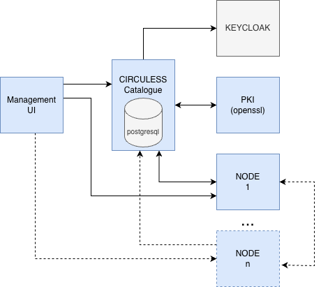

# CIRCULESS Cloud Platform

Docker Compose deployment for the CIRCULESS (Circular Economy Supply Chain Ecosystem) Cloud platform, providing infrastructure for secure data collaboration, identity management, and PKI services.



## Services

- **PKI Service** - Certificate lifecycle management using OpenSSL
- **Collaboration Catalogue** - Data catalogue with metadata and access policies
- **PostgreSQL** - Database backend

## Prerequisites

- Docker Engine 20.10+
- Docker Compose v2.0+
- Traefik reverse proxy with SSL resolver (`myresolver`)
- DNS configuration pointing to your server

## Quick Start

### 1. Clone and Configure

```bash
git clone <repository-url>
cd circuless-cloud
cp .env.example .env
```

Edit `.env` with your domains, credentials, and settings.

### 2. Generate Certificate Authority

```bash
./generateCAs.sh
```

This creates the necessary CA certificates and keys in the `certs` folder.

### 3. Deploy

```bash
docker compose up -d
```

### 4. Initialize Database

```bash
./initdb.sh
```

## Configuration

All sensitive configuration is managed through the `.env` file:

- **Domains**: PKI, Collaboration Catalogue, and OIDC endpoints
- **Database**: Credentials and connection settings
- **PKI**: CA paths, CRL settings, and authentication
- **OIDC**: Realm configuration and secrets

See `.env.example` for all available options.

## Architecture

```
Internet → Traefik (SSL/TLS) → PKI Service
                              → Collaboration Catalogue → PostgreSQL
```

## Deployment Guide

*Detailed deployment documentation coming soon.*

## License

Licensed under [Apache License 2.0](https://www.apache.org/licenses/LICENSE-2.0).

## Support

Contact bAvenir at support@bavenir.com
